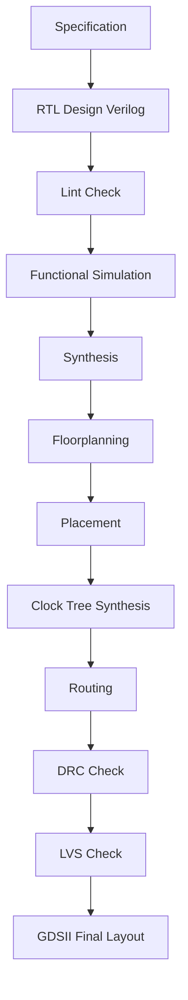

# RTL → GDS Complete Flow using Open Source Tools

This repository demonstrates a **complete RTL → GDSII flow** using fully **open-source EDA tools**.

The goal of this project is to design a digital circuit in **Verilog RTL** and convert it into a **GDSII layout**, representing the final chip design ready for fabrication.

---

# Project Objectives

- 🎓 Academic seminar demonstration
- 📘 Learn complete VLSI design flow
- 🧪 Hands-on ASIC design practice
- 🏭 Understand real chip design pipeline
- 🔧 Practice open-source EDA tools

---

# Complete RTL → GDS Flow


# Open Source Tools Used

| Stage | Tool |
|------|------|
| RTL Design | Verilog |
| Linting | Verilator |
| Simulation | Icarus Verilog / Verilator |
| Waveform Viewer | GTKWave |
| Synthesis | Yosys |
| Formal Verification (optional) | SymbiYosys |
| PDK | Sky130 |
| Physical Design | OpenROAD |
| Complete RTL → GDS Flow | OpenLane |
| DRC | Magic |
| LVS | Netgen |
| Layout Viewer | KLayout |

---

# Project Directory Structure

```
rtl2gds-project/
│
├── README.md
├── LICENSE
│
├── rtl/
│   ├── top.v
│   ├── uart_tx.v
│   ├── uart_rx.v
│   ├── fifo.v
│   └── include/
│       └── defines.vh
│
├── tb/
│   ├── tb_top.v
│   └── test_vectors/
│
├── sim/
│   ├── run_iverilog.sh
│   ├── run_verilator.sh
│   ├── waveform/
│   │   └── dump.vcd
│   └── logs/
│
├── lint/
│   └── verilator_lint.sh
│
├── synth/
│   ├── synth.ys
│   ├── constraints.sdc
│   └── reports/
│
├── formal/
│   ├── symbiyosys.sby
│   └── properties.sv
│
├── openlane/
│   └── design/
│       └── project_name/
│           ├── config.json
│           ├── src/
│           │   ├── top.v
│           │   ├── uart_tx.v
│           │   ├── uart_rx.v
│           │   └── fifo.v
│           └── runs/
│
├── pdk/
│   └── sky130/
│       └── README.md
│
├── scripts/
│   ├── run_sim.sh
│   ├── run_synth.sh
│   ├── run_openlane.sh
│   └── clean.sh
│
├── results/
│   ├── simulation/
│   ├── synthesis/
│   ├── reports/
│   ├── layout/
│   └── gds/
│       └── final.gds
│
├── docs/
│   ├── rtl_architecture.md
│   ├── rtl_to_gds_flow.md
│   ├── block_diagram.png
│   ├── timing_diagram.png
│   └── images/
│
└── Makefile
```

---

# Step-by-Step Guide

## Step 1 — Write RTL Design

Write Verilog RTL files inside the `rtl/` directory.

Guidelines:

- Use synchronous logic with posedge clock
- Avoid inferred latches
- Keep modular structure

---

## Step 2 — Lint Check

```bash
verilator --lint-only rtl/*.v
```

---

## Step 3 — Functional Simulation

```bash
iverilog -o sim.vvp tb/tb_top.v rtl/*.v
vvp sim.vvp
gtkwave dump.vcd
```

---

## Step 4 — Synthesis

```bash
yosys -p "read_verilog rtl/*.v; synth -top top; stat"
```

---

## Step 5 — Install OpenLane

```bash
git clone https://github.com/The-OpenROAD-Project/OpenLane
cd OpenLane
make setup
```

---

## Step 6 — Configure OpenLane

```json
{
    "DESIGN_NAME": "top",
    "VERILOG_FILES": "dir::src/*.v",
    "CLOCK_PORT": "clk",
    "CLOCK_PERIOD": 10
}
```

---

## Step 7 — Run Flow

```bash
make mount
./flow.tcl -design project_name
```

---

# Outputs

| File | Description |
|------|------------|
| dump.vcd | waveform |
| synth.v | gate netlist |
| final.def | placed design |
| final.gds | final layout |

---

# Author

Tejas Dabhankar

