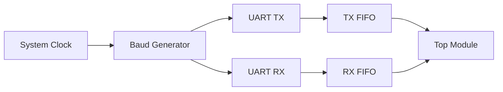
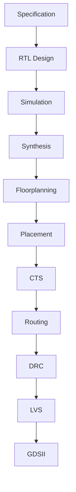

# UART RTL → GDS Project

This project demonstrates a complete **ASIC design flow** from **RTL (Verilog)** to **GDSII layout** using open-source tools.

The goal is to build a fully working UART peripheral and take it through:

Specification → RTL → Simulation → Synthesis → Physical Design → GDSII

---

## Features

- 8-bit UART communication
- configurable baud rate
- transmitter and receiver
- FIFO buffering
- FSM based design
- synthesizable RTL
- OpenLane compatible

---

## Block Diagram



---

## Project Structure

```
project_uart/
│
├── rtl/
│   ├── uart_tx.v
│   ├── uart_rx.v
│   ├── fifo.v
│   ├── baud_gen.v
│   └── top_uart.v
│
├── tb/
│   └── uart_tb.v
│
├── sim/
│
├── synth/
│
├── openlane/
│
└── docs/
```

---

## Modules

### uart_tx.v
Transmits serial data.

Responsibilities:
- start bit generation
- data shifting
- stop bit generation
- busy signal

---

### uart_rx.v
Receives serial data.

Responsibilities:
- start bit detection
- data sampling
- stop bit validation
- data ready signal

---

### fifo.v
Temporary data storage.

Responsibilities:
- buffer data between modules
- avoid data loss
- improve throughput

---

### baud_gen.v
Generates baud clock.

Responsibilities:
- divide system clock
- produce sampling ticks

---

### top_uart.v
Connects all modules.

Responsibilities:
- instantiate submodules
- define IO interface

---

## UART Frame Format

```
| start | data bits | stop |
|   0   | 8 bits    |  1   |
```

---

## Tools Used

- Verilog
- Icarus Verilog / Verilator
- GTKWave
- Yosys
- OpenLane
- Sky130 PDK

---

## Flow Diagram



---

## Current Status

- [ ] specification ready
- [ ] uart_tx design
- [ ] uart_rx design
- [ ] fifo design
- [ ] baud generator design
- [ ] top module integration
- [ ] testbench
- [ ] simulation pass
- [ ] synthesis pass
- [ ] openlane run
- [ ] gds generated

---
